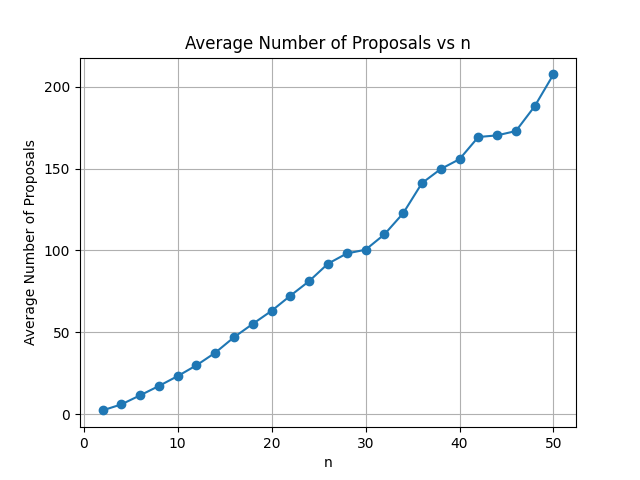
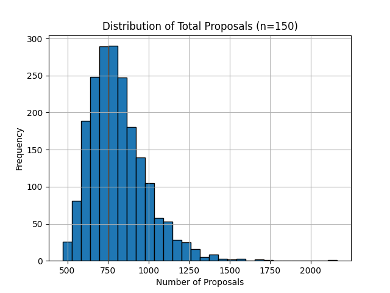
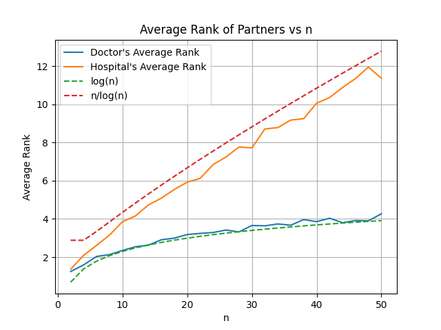
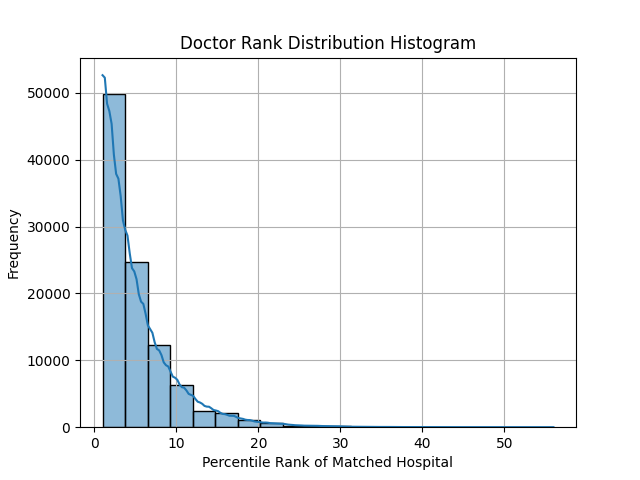
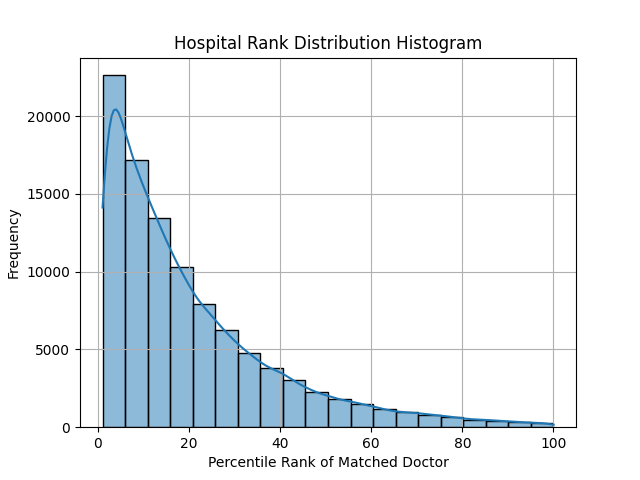
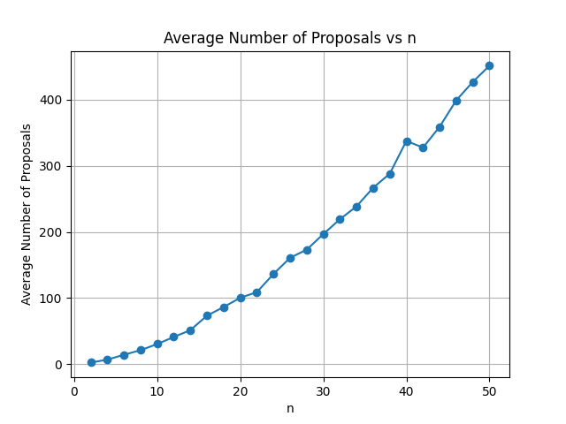
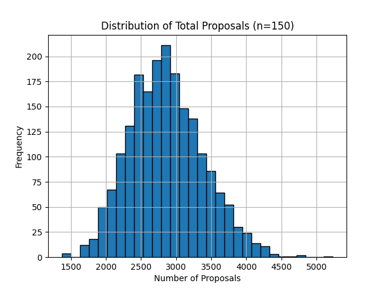
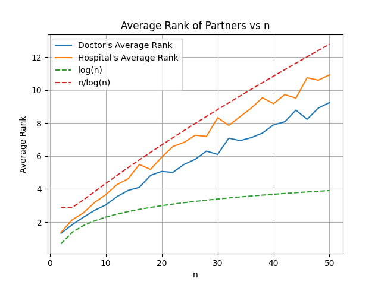
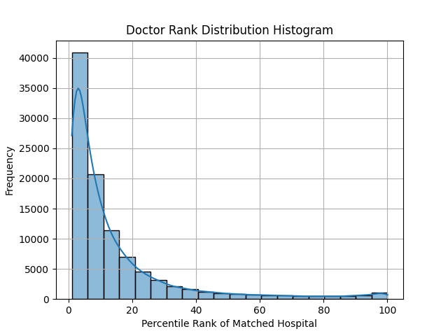
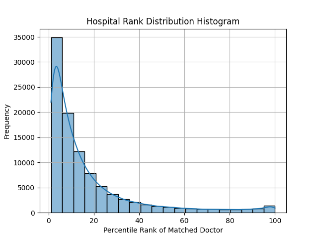

<h1 align="center">Empirical Analysis of the Gale-Shapley Deferred Acceptance Algorithm</h1>
<h3 align="center">(Under Uniform and Weighted Preferences)</h3>

  <strong>Author:</strong> Himanshu Goyal 
  <strong>Date:</strong> May 16, 2025

---

## Overview

In this project, we implement the Gale-Shapley Deferred Acceptance (DA) algorithm for the case of equal numbers of doctors and hospitals with one-to-one matchings. We empirically investigate the behavior of the algorithm under **independent and uniformly random preferences**, replicating and verifying results from the classical paper by Pittel.

## Part 1: Average Number of Proposals vs n

### Objective
To determine how many proposals are made, **on average**, during a run of **doctor-proposing** DA. We vary `n` (number of agents) and repeat the experiment multiple times for each `n`.

### Method
- For each `n`, generate random complete preference lists for all doctors and hospitals.
- Run the DA algorithm and count the number of proposals made until a stable matching is reached.
- Repeat the experiment `T` times and average the number of proposals.

### Result

The average number of proposals grows sub-quadratically and appears to follow a trend slightly steeper than linear, consistent with known theoretical bounds.

---

## Part 2: Proposal Distribution for Fixed n

### Objective
To understand the **distribution** of the number of proposals made during multiple runs of DA for a fixed `n`.

### Method
- Fix a reasonably large value of `n` (e.g., 50 or 100).
- Generate random preference lists and run the DA algorithm for `T = 1000` trials.
- Plot a histogram of the total number of proposals per run.

### Result

The histogram shows a concentrated distribution of proposal counts with some variance. The distribution is skewed slightly right, showing the possibility of higher proposal counts in some random instances.

---

## Part 3: Average Rank of Partners vs n

### Objective
To evaluate the **quality of matches** from both the doctor’s and hospital’s perspective, using their **rankings** of matched partners.

### Method
- For each `n`, and across several trials:
  - For each doctor, find the rank of the hospital they were matched with.
  - For each hospital, find the rank of the doctor they were matched with.
- Compute the average rank for each side.
- Plot these averages as functions of `n`.

### Result

- The doctor’s average rank scales as **log(n)** — confirming Pittel’s Theorem 2.
- The hospital’s average rank scales approximately as **n / log(n)** — again matching the theory.
- This confirms the **proposer-advantage** in the DA algorithm.

---

## Part 4 (Optional): Rank Distribution Histograms

### Objective
To analyze how many agents (doctors and hospitals) are matched to partners in the **top p%** of their preference lists.

### Method
- Fix a value of `n` (e.g., 100).
- For each agent, calculate the rank of their match as a percentile.
- Accumulate statistics over multiple trials.
- Plot histograms showing the rank distribution for both doctors and hospitals.

### Result

The histogram for doctors is skewed towards top preferences, reflecting their advantage. Hospitals, being on the receiving end, exhibit a wider spread in partner quality.

---

## Conclusion

This empirical study confirms key theoretical properties of the Gale-Shapley DA algorithm under uniform random preferences:
- The number of proposals grows sub-quadratically.
- The doctor-proposing DA gives a clear advantage to doctors.
- The expected rank behavior matches asymptotic predictions of **log(n)** and **n/log(n)** respectively.

# Extension: Gale-Shapley with Popularity-Based (Weighted) Preferences

## Overview

In this section, we explore a generalized model of preference generation based on agent popularity. Each doctor and hospital is assigned a unique popularity score from the set {1, 2, ..., n}. These scores influence the probability that an agent appears earlier in another agent's preference list.

### Preference Generation Method

- Let `a₁ < a₂ < ... < aₙ` be `n` ascending natural numbers.
- Each doctor and hospital receives one of these numbers randomly (permuted).
- A doctor constructs their preference list by repeatedly selecting an unpicked hospital with probability proportional to its popularity score (i.e., hospital *i* is chosen with probability *aᵢ / A*, where *A = ∑aⱼ over unpicked*).
- The same approach is applied for hospital preferences.

> This model generalizes the uniform random preference model (when all popularity scores are equal).

---

## Rank Distribution Analysis (Weighted Model)

We apply the doctor-proposing DA algorithm under this new preference model and analyze the resulting match quality in terms of percentile ranks.

---

## Part 1: Average Number of Proposals vs n

**Observation:**  
The number of proposals increases non-linearly with `n`, but more sharply than in the uniform model. This suggests that **popularity-weighted preferences introduce more proposal rounds**, likely due to competition for highly popular hospitals.

---

## Part 2: Proposal Distribution for Fixed n

**Observation:**  
The distribution is bell-shaped (roughly normal), centered around a higher mean than the uniform model. This reinforces the idea that **more iterations are needed when preferences are skewed by popularity**.

---

## Part 3: Average Rank of Partners vs n

**Observation:**
- The doctor's average rank increases linearly with `n`, diverging from the logarithmic behavior seen in the uniform model.
- The hospital's average rank also increases, but slightly more slowly.
- This indicates that **doctors are not able to secure their top choices as easily** when preferences are skewed—**popularity reduces the proposer advantage**.

---

## Part 4: Rank Distribution Histograms

### Doctor Rank Distribution

**Observation:**  
Doctors are more likely to match with top-percentile hospitals (lower rank values), but the curve is heavier-tailed than in the uniform case. This suggests that **competition for popular hospitals results in a wider spread of match quality** among doctors.

### Hospital Rank Distribution

**Observation:**  
The distribution is heavily skewed toward top-percentile doctors, with many hospitals matched to highly ranked individuals. This implies **hospitals benefit more in this model**, perhaps because they are more likely to be highly ranked by popular doctors due to shared bias.

---

## Part 5: Compare Different Distributions

| Model         | Avg Doctor Rank | Avg Hospital Rank |
|---------------|------------------|--------------------|
| Equal         | 4.22             | 11.67              |
| Linear        | 8.93             | 11.25              |
| Exponential   | 23.99            | 24.13              |

**Observation:**  
- As the preference distribution becomes more skewed (from equal to exponential), the **average doctor rank increases significantly**, indicating deteriorating match quality for proposers.
- Interestingly, the **average hospital rank remains relatively stable**, showing that popularity skews help balance power more in favor of hospitals.

---

## Summary of Key Differences from Uniform Model

| Metric                            | Uniform Model          | Weighted (Popularity-Based) Model           |
|----------------------------------|------------------------|---------------------------------------------|
| Preference generation            | Equal probability      | Skewed by popularity                        |
| Doctor match rank distribution   | Logarithmic scaling    | Linear/log-linear, depends on skew strength |
| Hospital match rank distribution | n/log n wide spread    | Still wide, but favors more popular agents  |
| Proposal count                   | Sublinear growth       | Faster-than-linear due to competition       |
| Distribution fairness            | High for doctors       | More balanced, hospitals gain advantage     |

---

## Conclusion

This weighted preference model highlights how **structured popularity shifts power dynamics** in the Gale-Shapley algorithm:
- **Doctors lose some of the proposer advantage**, particularly in highly skewed distributions.
- **Hospitals benefit more**, securing better matches due to being more desirable.
- The algorithm still terminates in stable matchings, but the **quality and distribution of outcomes vary significantly** with the underlying preference model.

